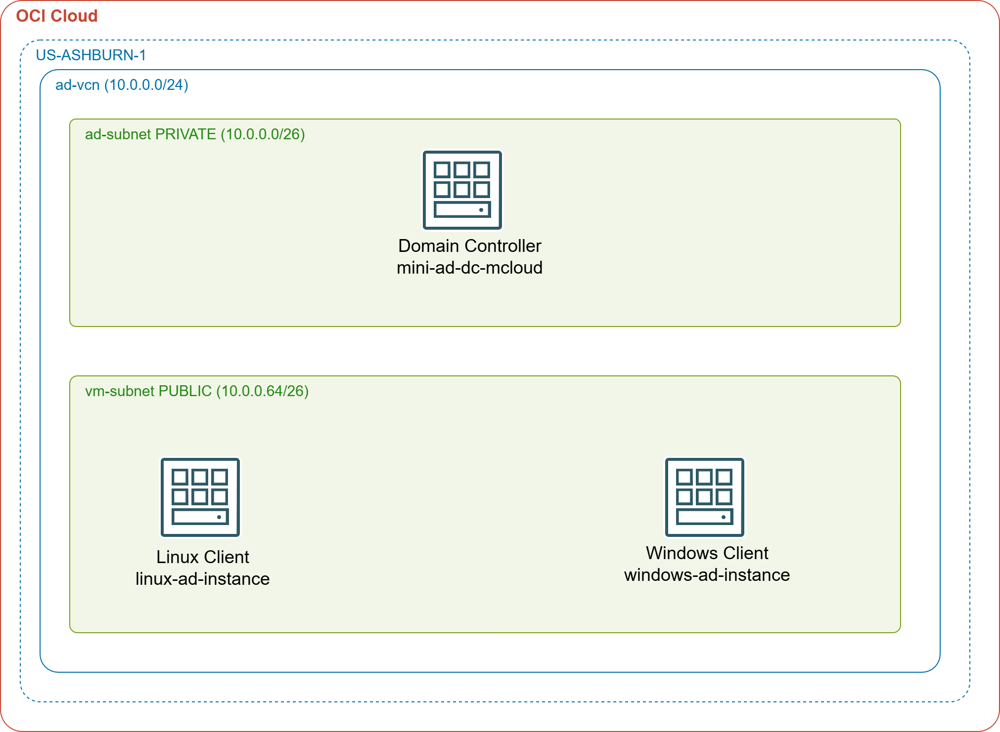

# OCI Mini Active Directory

This project deploys a fully functional Active Directory environment on OCI in minutes using Terraform, Samba 4, and automated configuration scripts. It is designed as a low-cost alternative to managed directory services for labs, demos, and development environments.




An Ubuntu-based OCI compute instance acts as both a Domain Controller and DNS server, integrated into a custom VCN with secure networking and OCI Bastion Service for private instance access. Windows and Linux instances are also deployed and automatically join the domain at boot, enabling seamless AD authentication across platforms.

This solution is **not intended for production use**, but provides a complete, repeatable environment for testing AD-connected workloads on OCI.

---

## Limitations

While the mini-AD deployment provides a functional and cost-effective Active Directory environment for labs and development, it does not include many of the advanced features found in a managed directory service. Key gaps include:

- **High Availability** — Single domain controller with no redundancy or failover.
- **Automated Backups** — No built-in backup or point-in-time recovery.
- **Automatic Patching** — OS and Samba updates require manual intervention.
- **GPO Replication** — Samba GPO support is limited; no automatic replication.
- **PowerShell AD Cmdlets** — Samba lacks native AD Web Services; many cmdlets do not work.
- **Production Security Hardening** — Security posture depends entirely on your configuration.

---

## Why We Did Not Use OCI Vault

OCI KMS Vault was the natural choice for storing generated AD passwords securely, and we did implement it initially. Each AD account password was stored as a versioned secret in a DEFAULT vault, and the Linux client retrieved its domain-join credential at boot using OCI instance principal authentication — so no plaintext password ever appeared in instance metadata or Terraform outputs.

However, OCI imposes a **mandatory 30-day pending-deletion hold** on KMS vaults after they are destroyed. During this hold the vault still counts against the tenancy service limit, which defaults to one vault per tenancy even on pay-as-you-go accounts. This makes the vault fundamentally incompatible with IAC destroy/rebuild workflows: every fresh `apply` after a `destroy` fails with `LimitExceeded` because the previous vault is still in `PENDING_DELETION`. The only workaround — cancelling the deletion and importing the vault back into Terraform state — is a manual operation that defeats repeatable automation.

AWS Secrets Manager and Azure Key Vault both handle deletion gracefully and do not block re-creation. This is an OCI platform deficiency.

**Current approach:** Passwords are stored as sensitive outputs in `terraform.tfstate`. The admin password is injected into client instances at apply time via `templatefile`, matching the pattern used for the Windows instance from the start. Use `./get_password.sh` to retrieve any credential directly from Terraform state.

---

## Prerequisites

- An OCI account with available Always Free resources
- [OCI CLI](https://docs.oracle.com/en-us/iaas/Content/API/SDKDocs/cliinstall.htm) configured with a DEFAULT profile in `~/.oci/config`
- [Terraform](https://developer.hashicorp.com/terraform/install) (latest)
- `jq` installed in PATH

---

## Download this Repository

```bash
git clone https://github.com/mamonaco1973/oci-mini-ad.git
cd oci-mini-ad
```

---

## Build the Code

Run `check_env.sh` to validate your environment, then run `apply.sh` to provision the infrastructure.

```bash
export OCI_COMPARTMENT_ID=<your-compartment-ocid>   # optional; falls back to tenancy OCID
./apply.sh
```

The deploy runs in two phases:

1. **01-directory** — VCN, subnets, bastion, and the Samba 4 DC. Waits for the DC to signal bootstrap completion before updating DHCP options.
2. **02-servers** — Linux and Windows client instances that domain-join at first boot.

Total build time is approximately 15–20 minutes end to end.

---

## Build Results

When the deployment completes, the following resources are created:

**Networking:**
- VCN with public subnets (vm-subnet-1, vm-subnet-2) and a private subnet (ad-subnet)
- Internet Gateway and NAT Gateway for controlled outbound access
- Route tables for both public and private subnets
- Security lists for client and DC traffic

**Active Directory:**
- Ubuntu 24.04 ARM64 instance (VM.Standard.A1.Flex, always-free) running Samba 4 as a Domain Controller
- Private subnet placement — no public IP
- VCN DHCP options updated to point DNS at the DC after provisioning

**Credentials:**
- All AD account passwords generated randomly and stored as sensitive outputs in `terraform.tfstate`
- Retrieved via `./get_password.sh` — no external secret store required

**Bastion:**
- OCI Bastion Service (STANDARD, free) for SSH access to the private DC

**Client Instances:**
- Ubuntu 24.04 Linux instance (VM.Standard.E4.Flex) joined to the domain
- Windows Server 2022 instance (VM.Standard.E4.Flex) joined to the domain

---

## Users and Groups

The following sample users and groups are created automatically during DC provisioning.

### Groups

| Group Name   | gidNumber |
|--------------|-----------|
| mcloud-users | 10001     |
| us           | 10002     |
| india        | 10003     |
| linux-admins | 10004     |

### Users

| Username | Full Name   | uidNumber | gidNumber | Groups                           |
|----------|-------------|-----------|-----------|----------------------------------|
| jsmith   | John Smith  | 10001     | 10001     | mcloud-users, us, linux-admins   |
| edavis   | Emily Davis | 10002     | 10001     | mcloud-users, us                 |
| rpatel   | Raj Patel   | 10003     | 10001     | mcloud-users, india, linux-admins|
| akumar   | Amit Kumar  | 10004     | 10001     | mcloud-users, india              |

---

## Connecting to the DC

The DC has no public IP. Use `connect.sh` to create an OCI Bastion port-forwarding session and drop into a shell:

```bash
./connect.sh            # connects to the DC
./connect.sh 10.0.0.x   # connects to any private IP
```

---

## Retrieving Passwords

Passwords are read directly from Terraform state:

```bash
./get_password.sh admin
./get_password.sh jsmith
./get_password.sh edavis
./get_password.sh rpatel
./get_password.sh akumar
./get_password.sh windows_local_admin
```

Output:
```
Username : jsmith@mcloud.mikecloud.com
Password : <generated-password>
```

---

## Connecting to the Linux Instance

The Linux client has a public IP. SSH directly using the generated key:

```bash
ssh -i 01-directory/keys/Private_Key -o StrictHostKeyChecking=no ubuntu@<linux_public_ip>
```

Run `./validate.sh` to print the DC IP, bastion ID, and connection hints.

---

## Connecting to the Windows Instance

Use the public IP shown in Terraform outputs. Connect via RDP with domain credentials:

- **Username:** `MCLOUD\Admin` or any domain user from the table above
- **Password:** retrieved via `./get_password.sh <user>`

---

## Clean Up

```bash
./destroy.sh
```

Destroys 02-servers first, then 01-directory. All OCI resources are deleted immediately — no retention periods.
